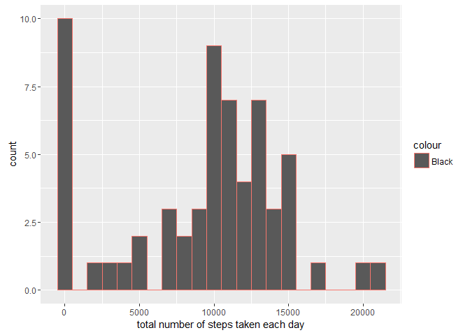
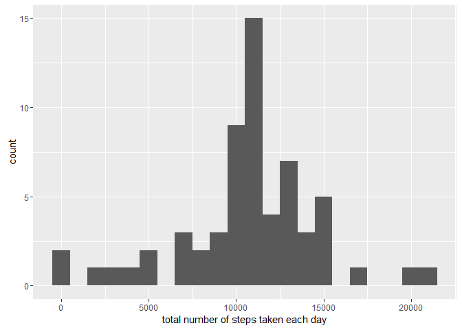
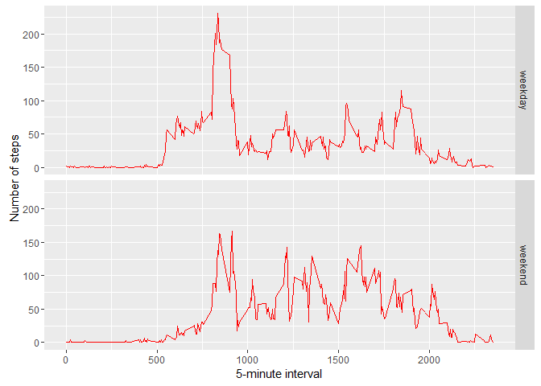

# Reproducible Research: Peer Assessment 1


# Loading and preprocessing the data


1. Loading Data from activity.csv file


```r
activityData <- read.csv('activity.csv')

str(activityData)
```

```
## 'data.frame':	17568 obs. of  3 variables:
##  $ steps   : int  NA NA NA NA NA NA NA NA NA NA ...
##  $ date    : Factor w/ 61 levels "2012-10-01","2012-10-02",..: 1 1 1 1 1 1 1 1 1 1 ...
##  $ interval: int  0 5 10 15 20 25 30 35 40 45 ...
```

2. Load required libraries


```r
library(knitr)
library(ggplot2)
```

```
## Warning: package 'ggplot2' was built under R version 3.2.3
```


3. Preprocessing the data

```r
activityData$date <- as.Date(activityData$date, format = "%Y-%m-%d")
```


# What is mean total number of steps taken per day?

1. Calculate the total steps per day

```r
total.steps <- tapply(activityData$steps, activityData$date, FUN=sum, na.rm=TRUE)
qplot(total.steps, binwidth=1000,color="Black", xlab="total number of steps taken each day")
```



```r
stepsMean<-mean(total.steps, na.rm=TRUE)
stepsMedian<- median(total.steps, na.rm=TRUE)
```

##Display Mean and Median before imputing missing values


```r
print(stepsMean)
```

```
## [1] 9354.23
```

```r
print(stepsMedian)
```

```
## [1] 10395
```

## What is the average daily activity pattern?


```r
averageStepsPerInterval <- aggregate(x=list(steps=activityData$steps), by=list(interval=activityData$interval), FUN=mean, na.rm=TRUE)
#str(averageStepsPerInterval)
#str(activityData)
```

# Make a time series plot


```r
#summary(activityData)
#str(activityData)
#summary(averageStepsPerInterval)
#str(averageStepsPerInterval)
ggplot(data=averageStepsPerInterval, aes(x=interval, y=steps)) +
    geom_line(color="blue") +
    xlab("5-minute interval") +
    ylab("average number of steps taken")
```


##On average across all the days in the dataset, the 5-minute interval contains the maximum number of steps?


```r
averageStepsPerInterval[which.max(averageStepsPerInterval$steps),]
```

```
##     interval    steps
## 104      835 206.1698
```

# Imputing missing values

##Total number of missing values in Steps


```r
missing <- sum(is.na(activityData$steps))
missing
```

```
## [1] 2304
```

#Strategy for imputing missing values

### Create a function na_fill(steps, interval) to identify transaction which has missing value.


1.Replace each missing value with the mean value of its 5-minute interval


```r
fill.value <- function(steps, interval) {
    filled <- NA
    if (!is.na(steps))
        filled <- c(steps)
    else
        filled <- (averageStepsPerInterval[averageStepsPerInterval$interval==interval, "steps"])
    return(filled)
}
filled.data <- activityData
filled.data$steps <- mapply(fill.value, filled.data$steps, filled.data$interval)
```

2. A histogram of the total number of steps taken each day


```r
total.steps <- tapply(filled.data$steps, filled.data$date, FUN=sum)
qplot(total.steps, binwidth=1000, xlab="total number of steps taken each day")
```



3. Calculate mean and median of steps after imputing missing values


```r
mean(total.steps)
```

```
## [1] 10766.19
```

```r
median(total.steps)
```

```
## [1] 10766.19
```

#What is the impact of imputing missing data on the estimates of the total daily number of steps?
Comparing before and after imputing missing data in steps shows that while the mean value remains unchanged, the median value has shifted and matches to the mean value.

**Result:  Mean and Median are equal after imputing the missing Steps values.**

# Are there differences in activity patterns between weekdays and weekends?

1.Step to find the day of the week for each measurement in the datasetdataset with the filled-in values.


```r
weekday.or.weekend <- function(date) {
    day <- weekdays(date)
    if (day %in% c("Monday", "Tuesday", "Wednesday", "Thursday", "Friday"))
        return("weekday")
    else if (day %in% c("Saturday", "Sunday"))
        return("weekend")
    else
        stop("invalid date")
}
filled.data$date <- as.Date(filled.data$date)
filled.data$day <- sapply(filled.data$date, FUN=weekday.or.weekend)
```

2. Create a panel plot containing plots of average number of steps taken on weekdays and weekends.


```r
averages <- aggregate(steps ~ interval + day, data=filled.data, mean)

averages <- aggregate(steps ~ interval + day, data=filled.data, mean)
ggplot(averages, aes(interval, steps)) + geom_line(color="red") + facet_grid(day ~ .) +
    xlab("5-minute interval") + ylab("Number of steps")
```



**Results : Above gram shows that activity on the weekday has the greatest peak from all steps intervals. But, we can see weekend better distribution of effort along the time.**

